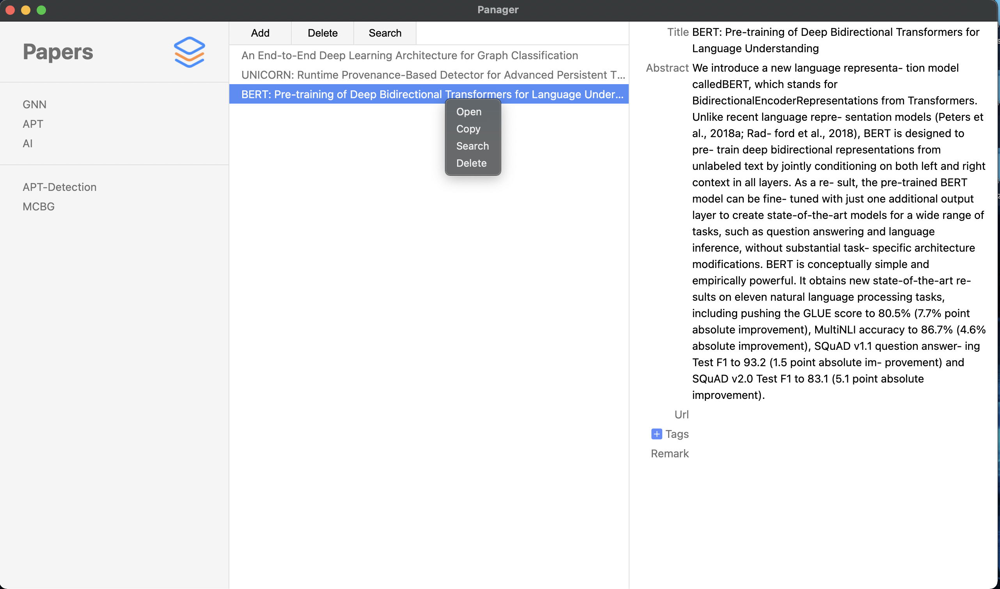

# Papers
Paper manage app built with Electron.

# Prerequisite
- Electron 11.2.3
- node 15.8.0
- nedb 1.8.0
- pdf-parse 1.1.1

# Overview
- [x] UI
  - [x] Library
  - [x] Paper list
  - [x] Overview
- [ ] **Overview** for paper
  - [x] Title
  - [x] Abstract
  - [x] Publisher
  - [x] Url
  - [x] Tags
  - [ ] Remark
    - [ ] Link to remark file
- [ ] **Operation** on paper
  - [x] Add: Support Drag and Drop Files
  - [x] Select and delete
  - [ ] Select multiple and delete
  - [x] Right menu
  - [x] Search with Google Scholar
  - [x] Delete

# Screenshot

# Notes
- [x] Add global tags bug: `ipcRenderer.on` should be outside of `click` event.
- [x] Package
  - [electron-packager](https://github.com/electron/electron-packager/issues) & [create-dmg](https://github.com/create-dmg/create-dmg)

# Progress
- [x] Global Menu
- [x] Adjust global `current_paper` value.