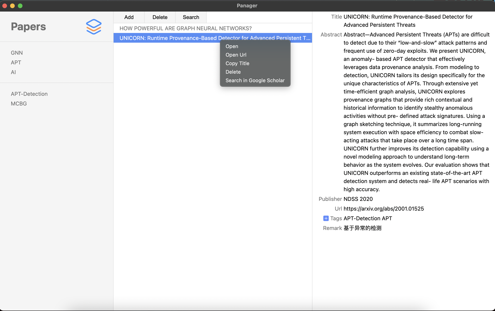

# Papers
Paper manage app built with Electron.

# Prerequisite
- Electron 11.2.3
- node 15.8.0
- nedb 1.8.0
- pdf-parse 1.1.1

# Overview
- [x] UI
  - [x] Library
    - [x] Add tags
    - [x] Remove tags
  - [x] Paper list
  - [x] Overview
- [ ] **Overview** for paper
  - [x] Title
  - [x] Abstract
    - [x] Extract abstract automatically
  - [x] Publisher
  - [x] Url
  - [x] Tags
    - [x] Add/Remove tags
  - [ ] Remark
    - [x] Edit remark
    - [ ] Link to remark file
- [x] **Operation** on paper
  - [x] Add
  - [x] Add2: Drag and Drop Files
  - [x] Select and delete
  - [ ] Select multiple and delete
  - [x] Right menu
    - [x] Copy title
    - [x] Delete
    - [x] Open
    - [x] Search with Google Scholar
    - [x] Open Url
  - [x] Search with Google Scholar
  - [x] Delete

# Screenshot

# TODO
- [x] Add global tags bug: `ipcRenderer.on` should be outside of `click` event.
- [ ] Package.